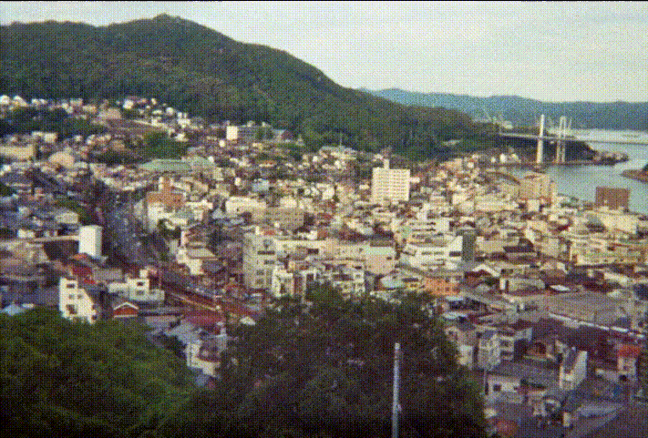
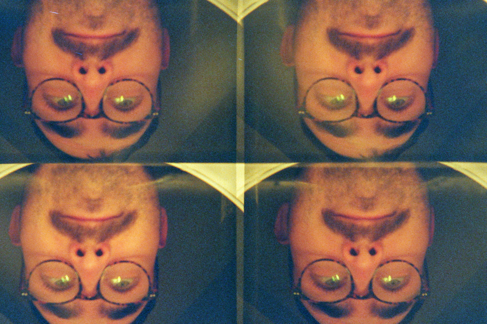
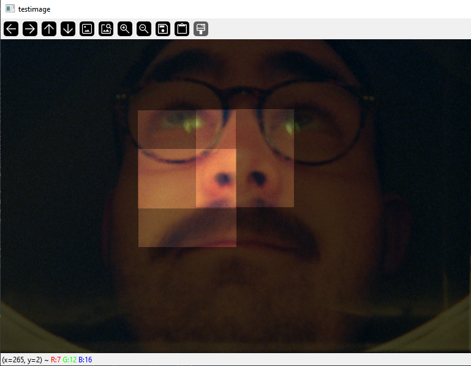
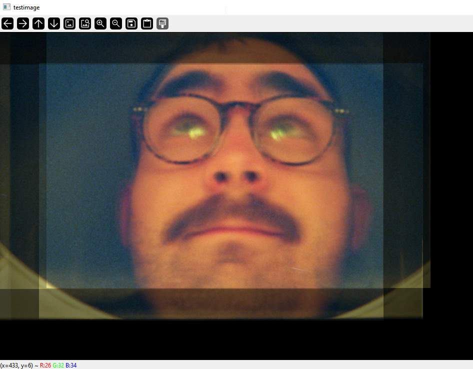

# actionsampler-wigglegram

---

Wigglegrams were a thing from the 35mm analog film era that can now be revived with the new Actionsampler camera.
It is a very cheaply made camera that eats 35mm film and exposes 4 separate images onto a normal 35mm film frame.
In theory this allows for two interesting use-cases to take creative pictures.

- closeup still shots creating a "3D" effect 
- short 1s videos at 4fps

| 3D effect | video |
|:----------|:------|
|  |  |
| selfie with a torch light straight to my face (still kinda underexposed) | a train in Onomichi Japan, summer 2025 | 

Naturally, the 4 images on the 35mm photo will be aligned to nothing.
This pyhon script aims tries to auto-align and crop the images to then use with `ffmpeg` to create the short gifs.

**the camera**


---

### How the script works

The alligner performs the following steps in order:

1. import scanned analog image
2. ~~add black border around the image~~
3. crop the image into equal 1/4 slices
4. convert the slices to HSV space
5. use the first slice (top-left) as reference to compare against
7. pick a square (1/4 wide) on the 3 remaining slices
6. bruteforce `for` loop searches for the smallest _L2-norm_ difference of a sliding square window on the reference slice
7. (overlay all squares onto the 1. slice to verify correct convergece)
8. transform the square coordinates back to slice coordinates
9. create a large black image
10. (overlay all images to verify correct coordinate transform)
11. save each of the 4 offset images


**input image**



| Step. 7 | Step. 10 |
|:----------|:------|
|  |  |
| squares correctly matched to reference image | all 4 images overlayed (with black border) | 

---

### Create a GIF

```bash
ffmpeg -framerate 8 -pattern_type glob -i './*.jpg' -c:v libx264 -pix_fmt yuv420p face.mp4
ffmpeg -i face.mp4 face.gif
```

---

### Limitations and known issues

Using this script is a semi-automatic process.
For some images the auto alignment might fail (partially) and manual adjustment of (some of) the coordinates is required.

Since the alignment is a brute force method, it might take a few seconds to process each subframe. The search radius and the square size are parametrizable and have a significant impact on the processing time.
Expect ~1min for the provided example image (1024x1536).

The script may fail if:
- the subject is not at the center of each frame
- very dynamic shots that capture a lot of movement
- very empty subjects (like a wall / sky)

The script works well on:
- still subjects (a face)
- "busy" landscapes

Other considerations:
- should the wigglegram center and stabilize the subject (still face) or the background (moving subject)!

---

### Requirements

The script was created and used in `spyder` using the following modules:

- `numpy` 
- `opencv`

```bash
conda install -c menpo opencv
```

### Acknowledgements

@jyjblrd | [3D-Printed-Film-Video-Camera](https://github.com/jyjblrd/3D-Printed-Film-Video-Camera) for the `ffmpeg` commands
